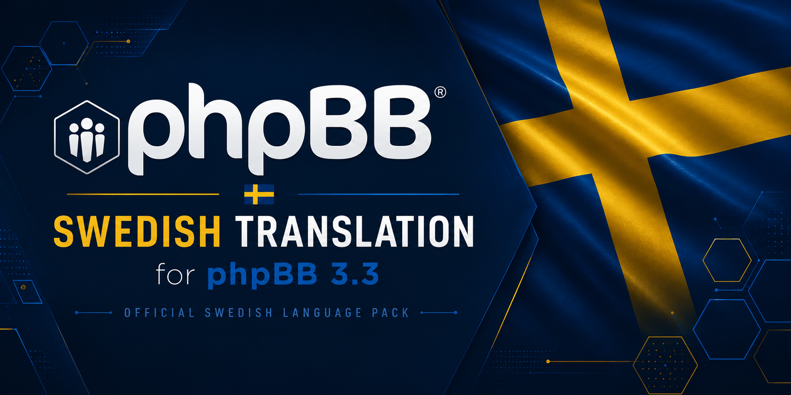

# 🇸🇪 Svenska språkpaketet för phpBB

<p align="center">
  
</p>

<p align="center">
  <strong>En komplett svensk översättning av phpBB.</strong><br>
  Ett communitydrivet projekt för att tillhandahålla ett aktuellt och korrekt svenskt språkpaket.
</p>

---

## 📌 Om projektet

Detta projekt innehåller den svenska översättningen för **phpBB**.

Målet är att erbjuda ett komplett språkpaket med:

- korrekt svensk översättning
- konsekvent terminologi
- kontinuerligt underhåll
- enkel installation
- tydlig versionshantering

Projektet är skapat för svenska phpBB-användare och administratörer som vill använda phpBB på svenska.

---

## 📦 Installation

### 1. Ladda ner språkpaketet

Gå till projektets **Releases** och ladda ner den senaste `.zip`-filen.

Exempel:

```
phpBB-3.3.17-sv-1.0.3.zip
```

---

### 2. Packa upp filen

Efter uppackning ska strukturen se ut ungefär så här:

```
styles/
language/
└── sv/
    ├── common.php
    ├── acp/
    ├── email/
    └── ...
ext/
```

---

### 3. Installera språkpaketet

Kopiera mapparna:

```
styles/
language/
ext/
```

till din phpBB-installation (root):

```
phpBB/
```

Resultatet ska bli:

```
phpBB/
└── language/
    └── sv/
    styles/
    ext/
```

---

### 4. Aktivera svenska

Logga in i phpBB:s administrationspanel:

```
Administrationspanel
→ System
→ Språkpaket
```

Installera och aktivera svenska språket.

---

# 🔢 Versionshantering

Språkpaketen följer phpBB:s versionsnummer samt den svenska översättningens eget versionsnummer.

Filnamnet är uppbyggt enligt följande:

```
phpBB-[phpBB-version]-sv-[översättningsversion].zip
```

Exempel:

```
phpBB-3.3.17-sv-1.0.3.zip
```

Betyder:

| Del | Förklaring |
|---|---|
| `phpBB` | Projektet som språkpaketet gäller för |
| `3.3.17` | Version av phpBB som språkpaketet är anpassat för |
| `sv` | Svenskt språkpaket |
| `1.0.3` | Version av den svenska översättningen |
| `.zip` | Färdigt installationspaket |

---

## Exempel: `phpBB-3.3.17-sv-1.0.3.zip`

Denna fil betyder:

- Språkpaketet är anpassat för **phpBB 3.3.17**
- Språket är **svenska**
- Översättningen är version **1.0.3**

Versionsnumret efter `sv-` beskriver alltså själva översättningen och är separat från phpBB:s versionsnummer.

---

## Versionsnivåer för översättningen

Översättningen använder formatet:

```
MAJOR.MINOR.PATCH
```

Exempel:

```
1.0.3
```

---

### Major

Exempel:

```
2.0.0
```

Används vid större förändringar:

- ny struktur för språkpaketet
- större omarbetning av översättningen
- större förändringar kopplade till framtida phpBB-versioner

---

### Minor

Exempel:

```
1.1.0
```

Används vid:

- större mängder nya översatta språksträngar
- förbättrade översättningar
- större språkliga förändringar

---

### Patch

Exempel:

```
1.0.3
```

Används vid:

- stavningskorrigeringar
- grammatiska förbättringar
- mindre justeringar
- rättningar av befintliga språksträngar

---

## Exempel på versionshistorik

| Fil | Förklaring |
|---|---|
| `phpBB-3.3.17-sv-1.0.0.zip` | Första versionen av svenska översättningen för phpBB 3.3.17 |
| `phpBB-3.3.17-sv-1.0.1.zip` | Mindre korrigeringar |
| `phpBB-3.3.17-sv-1.0.3.zip` | Ytterligare förbättringar och rättningar |
| `phpBB-3.3.18-sv-1.0.0.zip` | Nytt språkpaket anpassat för phpBB 3.3.18 |

# 👥 Översättningsgruppen

Projektet underhålls av:

| Namn | Roll |
|---|---|
| Sinom | Huvudansvarig / utveckling |
| Holger | Översättning och granskning |

---

# 📁 Projektstruktur

```
phpBB_sv_translation/
│
├── language/
│   └── sv/
│       ├── acp/
│       ├── email/
│       └── *.php
│
├── images/
│   └── banner.png
│
├── README.md
│
└── LICENSE
```

---

# 🔄 Uppdateringar

När phpBB släpper nya versioner uppdateras språkpaketet vid behov.

Fokus ligger på:

- att nya språksträngar inkluderas
- att gamla översättningar fortfarande är korrekta
- att användare enkelt kan uppdatera sitt språkpaket

---

# 📝 Rapportera problem

Har du hittat en felaktig översättning eller saknar en språksträng?

Skapa gärna ett **Issue** med:

- phpBB-version
- aktuell språksträng
- föreslagen ändring
- eventuell förklaring

---

# 📜 Licens

Detta språkpaket följer samma licensprinciper som phpBB.

phpBB är utvecklat av:

https://www.phpbb.com/

Detta projekt är en svensk översättning och är inte en officiell produkt från phpBB Limited.

---

<p align="center">
  🇸🇪 <strong>Svensk phpBB-översättning</strong><br>
  Skapar gemenskap
</p>
